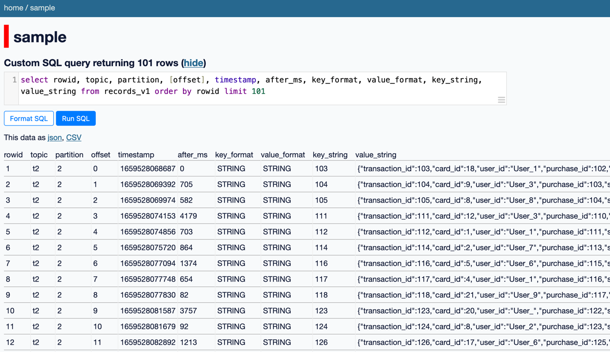
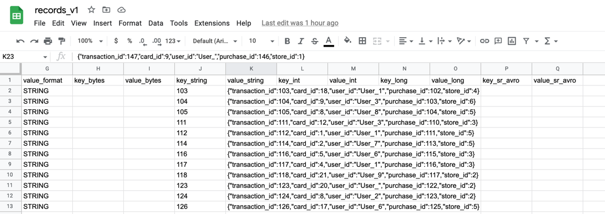

# Kafka Emulator

[](https://github.com/jeqo/kafka-cli/actions/workflows/cli-emulator-build.yml)

When building event-driven applications, events and _the time when they occur_ define the behavior in the consumer.
Though, reproducing or even testing those event conditions is not always easy.

Kafka Emulator (`kfk-emulator`) is a tool to record and replay events from Kafka topics.
Events are stored locally (in a SQLite database file) and can be tweaked to reproduce scenarios when replaying events.

Recording events take into account the gap between events in the same partition.
This gap is used when replaying events to include consider the time distance, and enforce the record timestamps.

- [Documentation](./docs/kfk-emulator.adoc)

## Install

### Brew

Add tap:

```shell
brew tap jeqo/tap
```

Install `kfk-ctx`:

```shell
brew install kfk-emulator
```

### Manual

Find the latest release at: <https://github.com/jeqo/kafka-cli/releases>

```shell
VERSION=0.3.0
wget https://github.com/jeqo/kafka-cli/releases/download/cli-emulator-v$VERSION/kfk-emulator-$VERSION-linux-x86_64.tar.gz
tar xf kfk-emulator-$VERSION-linux-x86_64.tar.gz
mv kfk-emulator-$VERSION-linux-x86_64/bin/kfk-emulator /usr/local/bin/.
```

## How to use

### Record events

Produce some data into a topic if there's none:

```shell
kfk-producer-datagen interval --kafka default \
  --topic t2 \
  -q TRANSACTIONS \
  -n 100 --interval 1000
```

With some data in topic `t2`, use the `kfk-emulator` to record records:

```shell
kfk-emulator record --kafka default \
  --topic t2 \
  --value-format STRING --key-format STRING \
  sample.db
```

This command will start consuming until there are not more messages returned (default poll timeout = 5 seconds) from all partitions.

This behavior can be changes to:

- `--end-now`: when timestamps after the instant when execution starts appear, partitions are marked as completed; and once all are, execution finishes.
- `-n`: records per partition
- `--end-at-ts=<ISO_DATE_TIME>`, e.g. "2022-08-03T18:00"
- `--end-at-offset=<max offset number on all partitions>`, e.g. "topic:0=10000,topic:1=20000"

Similar for starting point:

- `--start-at-ms`
- `--start-from-offsets`

Once execution completes, the SQLite file could be opened with any compatible tool, e.g. [datasette](https://datasette.io/)

```shell
datasette sample.db
```



### Modify events (optional)

Once events are recorded, the sqlite tables can be modified through any interface (e.g. SQL).

Another option is to transform SQLite tables to CSV and use good ol' Excel/Google Spreadsheet:

Using [sqlite-utils](https://sqlite-utils.datasette.io/):

```shell
sqlite-utils kfk-emulator.db "select * from records_v1" --csv > examples/records_v1.csv
```

Import CSV to Google Spreadsheet:



And reimport CSV into SQLite:

```shell
kfk-emulator init sample2.db
sqlite-utils insert sample2.db records_v1 sample2.csv --csv
```

### Replay events

Once records are ready to be replayed, use the `replay` command to reproduce the events:

```shell
kfk-emulator replay sample2.db --kafka default -t t2=t3
```

`-t` option is used to map topic names and write to a new topic if needed.
Topic will be created with the same partitions as the source.

## Emulator Archive Schema

### Table `records_v1`

Columns:

- `topic`: Topic name
- `partition`: Partition number
- `offset`: Offset position (nullable)
- `timestamp`: Record timestamp recorded (nullable)
- `after_ms`: Time period since previous message in the topic-partition
- `key_format` and `value_format`: Valid values "STRING", "BINARY", "INTEGER", "LONG", "SR_AVRO"
- `key_<format>` and `value_<format>`: columns containing record key/value content in the format requested by the recording option. (nullable)

### Table `schemas_v1`

Columns:

- `topic`: Topic using this schema
- `is_key`
- `schema_type` only supporting Avro at the moment
- `schema` schema definition
